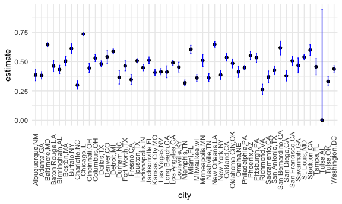
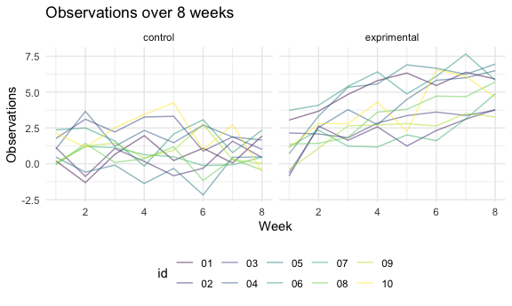
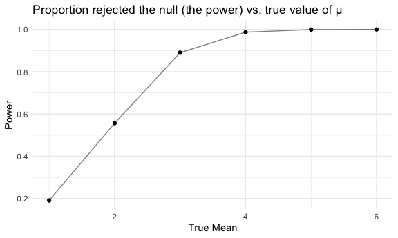
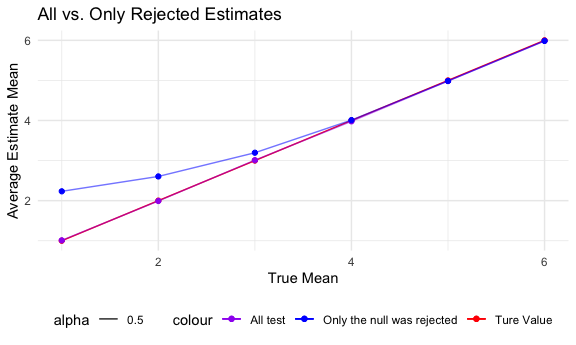

P8105_hw3_my2838
================

``` r
library(tidyverse)
```

    ## ── Attaching core tidyverse packages ──────────────────────── tidyverse 2.0.0 ──
    ## ✔ dplyr     1.1.3     ✔ readr     2.1.4
    ## ✔ forcats   1.0.0     ✔ stringr   1.5.0
    ## ✔ ggplot2   3.4.3     ✔ tibble    3.2.1
    ## ✔ lubridate 1.9.2     ✔ tidyr     1.3.0
    ## ✔ purrr     1.0.2     
    ## ── Conflicts ────────────────────────────────────────── tidyverse_conflicts() ──
    ## ✖ dplyr::filter() masks stats::filter()
    ## ✖ dplyr::lag()    masks stats::lag()
    ## ℹ Use the conflicted package (<http://conflicted.r-lib.org/>) to force all conflicts to become errors

``` r
library(ggplot2)
library(dplyr)

set.seed(123)

knitr::opts_chunk$set(
    echo = TRUE,
    warning = FALSE,
  fig.width = 6,
  fig.asp = .6,
  out.width = "90%"
)

theme_set(theme_minimal() + theme(legend.position = "bottom"))

options(
  ggplot2.continuous.colour = "viridis",
  ggplot2.continuous.fill = "viridis"
)

scale_colour_discrete = scale_colour_viridis_d
scale_fill_discrete = scale_fill_viridis_d
```

# Problem 1

``` r
homicide = 
  read_csv("homicide-data.csv") |>
  mutate(city_state = paste(city, state, sep = ","))
```

    ## Rows: 52179 Columns: 12
    ## ── Column specification ────────────────────────────────────────────────────────
    ## Delimiter: ","
    ## chr (9): uid, victim_last, victim_first, victim_race, victim_age, victim_sex...
    ## dbl (3): reported_date, lat, lon
    ## 
    ## ℹ Use `spec()` to retrieve the full column specification for this data.
    ## ℹ Specify the column types or set `show_col_types = FALSE` to quiet this message.

``` r
homicide_city = 
  homicide |>
  group_by(city_state, disposition) |>
  count(disposition) |>
  pivot_wider(
    names_from = disposition,
    values_from = n
  ) |>
  janitor::clean_names()   |>
  ungroup() |>
  mutate_all(~replace_na(., 0)) |>
  mutate(unsolved = closed_without_arrest + open_no_arrest,
         sum = closed_without_arrest + open_no_arrest + closed_by_arrest) |>
  filter(city_state != "Tulsa,AL")
```

``` r
prop_bal = 
  prop.test(
  x = homicide_city$unsolved[homicide_city$city_state == "Baltimore,MD" ],
  n = homicide_city$sum[homicide_city$city_state == "Baltimore,MD" ]
  ) |>
  broom::tidy() 

prop_bal |>
  knitr::kable()
```

|  estimate | statistic | p.value | parameter |  conf.low | conf.high | method                                               | alternative |
|----------:|----------:|--------:|----------:|----------:|----------:|:-----------------------------------------------------|:------------|
| 0.6455607 |   239.011 |       0 |         1 | 0.6275625 | 0.6631599 | 1-sample proportions test with continuity correction | two.sided   |

So the estimate proportion of homicides that are unsolved in the city of
Baltimore, MD is 0.6455607, and the confidence interval is \[0.6275625,
0.6631599\].

``` r
prop_test = function (city_name) {
    prop.test(
  x = homicide_city$unsolved[homicide_city$city_state == city_name],
  n = homicide_city$sum[homicide_city$city_state == city_name]
  ) |>
    broom::tidy()
}

city = data.frame(city = pull(homicide_city, city_state)) 
prob_test_res = purrr::map_df(pull(homicide_city, city_state), prop_test)
prob_city = bind_cols(city, prob_test_res) 
ggplot(prob_city, aes(x = city, y = estimate)) +
  geom_point(size = 0.8) +
  geom_errorbar(aes(ymin = conf.low, ymax = conf.high), width = 0.2) +
  labs(
  title="Observations on each subject over 8 weeks",
  x="City",
  y="Observations") +
  theme(axis.text.x = element_text(angle = 90, hjust = 0.5, vjust = 0.5))
```



# Problem 2

Import the data from the zip file.

``` r
full_data=
  tibble(
  files=list.files(path="data", full.names = TRUE))  |> 
  mutate(data=map(files,read.csv)) |>
  unnest(everything())
```

Create a tidy dataframe containing data from all participants, including
the subject ID, arm, and observations over time:

``` r
tidy_data=
  full_data |> 
  mutate(
    arm=ifelse(str_detect(files,"con"),"control","exprimental"),
    id=str_extract(files,"\\d+")
  ) |> 
  pivot_longer(
    cols=starts_with("week"),
    names_to ="week",
    values_to ="observations"
  ) |> 
  mutate(
    week=as.numeric(str_extract(week,"\\d+")))
```

Make a spaghetti plot showing observations on each subject over time.

``` r
ggplot(tidy_data, aes(x = week, y = observations, color = id)) +
  geom_line( alpha = 0.5 )+
  facet_wrap(.~arm)+
  labs(
    title="Observations over 8 weeks",
    x="Week",
    y="Observations"
    )
```



**Comment:** Over 8 weeks, the control arm group remain the same level,
while the experimental arm group show an increasing trend.

# Problem 3

First, set the design elements and function.

``` r
sim_t_test = function(mu){
test_res = 
  t.test(rnorm(n = 30, mean = mu, sd = 5)) |>
    broom::tidy() |>
    select(estimate, p.value)

  test_res
}
```

Set μ=0. Generate 5000 datasets from the model.

``` r
mean_0 =
  expand_grid( mu = 0, time = 1:5000) |>
  mutate(t_test_res = map(mu, sim_t_test)) |>
  unnest(t_test_res)
```

Repeat the above for μ={1,2,3,4,5,6}.

``` r
mean =
  expand_grid( mu = 1:6, time = 1:5000 ) |>
  mutate(t_test_res = map(mu, sim_t_test)) |>
  unnest(t_test_res)
```

Make a plot showing the proportion of times the null was rejected (the
power of the test) on the y axis and the true value of μ on the x axis.

``` r
test_power = 
  mean |>
  filter(p.value < 0.05) |>
  group_by(mu) |>
  count() |>
  mutate(power = n / 5000)

ggplot(test_power, aes(x = mu, y = power)) +
  geom_point() + 
  geom_line(alpha = 0.5) +
  labs(x = "True Mean", y = "Power", title = "Proportion rejected the null (the power) vs. true value of μ")
```



**Comment:** From the plot, we can see the power increases when the true
mean increases.

``` r
test_avg_estimate_all = 
  mean |>
  group_by(mu) |>
  summarise(avg_estimate = mean(estimate)) 

test_avg_estimate_reject = 
  mean |>
  filter(p.value < 0.05) |>
  group_by(mu) |>
  summarise(avg_estimate = mean(estimate)) 
  
  
ggplot() +
  geom_point(data = test_avg_estimate_all, aes(x = mu, y = mu, color = "Ture Value")) + 
  geom_line(data = test_avg_estimate_all, aes(x = mu, y = mu, color = "Ture Value")) + 
  geom_point(data = test_avg_estimate_all, aes(x = mu, y = avg_estimate, color = "All test")) + 
  geom_line(data = test_avg_estimate_all, aes(x = mu, y = avg_estimate, color = "All test", alpha = 0.5)) + 
  geom_point(data = test_avg_estimate_reject, aes(x = mu, y = avg_estimate 
, color = "Only the null was rejected")) +
  geom_line(data = test_avg_estimate_reject, aes(x = mu, y = avg_estimate 
, color = "Only the null was rejected", alpha = 0.5)) +
  scale_color_manual(values = c("Ture Value" = "red", "All test" = "purple", "Only the null was rejected" ="blue")) +
  labs(x = "True Mean", y = "Average Estimate Mean", title = "All vs. Only Rejected Estimates") 
```



**Comment:** From the plot, when the true mean is less than 4, we can
see a difference between the average estimate means between only the
tests which the null is rejected and all tests, so they are **not
approximately equal**.

when the true mean is greater than 4, The average estimate means between
only the tests which the null is rejected and all tests are
**approximately equal**.

The reason may be that in our previous plot, we can see the power is
approximately equal to 1 when the true mean is greater than 4, which
means that the null is rejected in almost all test.
