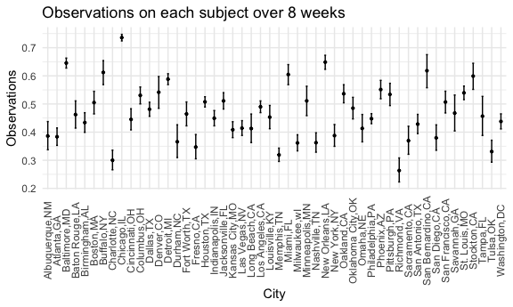

P8105_hw3_my2838
================

``` r
library(tidyverse)
```

    ## ── Attaching core tidyverse packages ──────────────────────── tidyverse 2.0.0 ──
    ## ✔ dplyr     1.1.3     ✔ readr     2.1.4
    ## ✔ forcats   1.0.0     ✔ stringr   1.5.0
    ## ✔ ggplot2   3.4.3     ✔ tibble    3.2.1
    ## ✔ lubridate 1.9.2     ✔ tidyr     1.3.0
    ## ✔ purrr     1.0.2     
    ## ── Conflicts ────────────────────────────────────────── tidyverse_conflicts() ──
    ## ✖ dplyr::filter() masks stats::filter()
    ## ✖ dplyr::lag()    masks stats::lag()
    ## ℹ Use the conflicted package (<http://conflicted.r-lib.org/>) to force all conflicts to become errors

``` r
library(ggplot2)
library(dplyr)

knitr::opts_chunk$set(
    echo = TRUE,
    warning = FALSE,
  fig.width = 6,
  fig.asp = .6,
  out.width = "90%"
)

theme_set(theme_minimal() + theme(legend.position = "bottom"))

options(
  ggplot2.continuous.colour = "viridis",
  ggplot2.continuous.fill = "viridis"
)

scale_colour_discrete = scale_colour_viridis_d
scale_fill_discrete = scale_fill_viridis_d
```

# Problem 1

``` r
homicide = 
  read_csv("homicide-data.csv") |>
  mutate(city_state = paste(city, state, sep = ","))
```

    ## Rows: 52179 Columns: 12
    ## ── Column specification ────────────────────────────────────────────────────────
    ## Delimiter: ","
    ## chr (9): uid, victim_last, victim_first, victim_race, victim_age, victim_sex...
    ## dbl (3): reported_date, lat, lon
    ## 
    ## ℹ Use `spec()` to retrieve the full column specification for this data.
    ## ℹ Specify the column types or set `show_col_types = FALSE` to quiet this message.

``` r
homicide_city = 
  homicide |>
  group_by(city_state, disposition) |>
  count(disposition) |>
  pivot_wider(
    names_from = disposition,
    values_from = n
  ) |>
  janitor::clean_names()   |>
  ungroup() |>
  mutate_all(~replace_na(., 0)) |>
  mutate(unsolved = closed_without_arrest + open_no_arrest,
         sum = closed_without_arrest + open_no_arrest + closed_by_arrest) 
```

``` r
prop_bal = 
  prop.test(
  x = homicide_city$unsolved[homicide_city$city_state == "Baltimore,MD" ],
  n = homicide_city$sum[homicide_city$city_state == "Baltimore,MD" ]
  ) |>
  broom::tidy() 

prop_bal |>
  knitr::kable()
```

|  estimate | statistic | p.value | parameter |  conf.low | conf.high | method                                               | alternative |
|----------:|----------:|--------:|----------:|----------:|----------:|:-----------------------------------------------------|:------------|
| 0.6455607 |   239.011 |       0 |         1 | 0.6275625 | 0.6631599 | 1-sample proportions test with continuity correction | two.sided   |

So the estimate proportion of homicides that are unsolved in the city of
Baltimore, MD is 0.6455607, and the confidence interval is \[0.6275625,
0.6631599\].

``` r
prop_test = function (city_name) {
    prop.test(
  x = homicide_city$unsolved[homicide_city$city_state == city_name],
  n = homicide_city$sum[homicide_city$city_state == city_name]
  ) |>
    broom::tidy()
}

city = data.frame(city = pull(homicide_city, city_state)) 
prob_test_res = purrr::map_df(pull(homicide_city, city_state), prop_test)
prob_city = bind_cols(city, prob_test_res) 
ggplot(prob_city, aes(x = city, y = estimate)) +
  geom_point() +
  geom_errorbar(aes(ymin = conf.low, ymax = conf.high), width = 0.2, color = "blue") +
  theme(axis.text.x = element_text(angle = 90, hjust = 0.5, vjust = 0.5))
```


